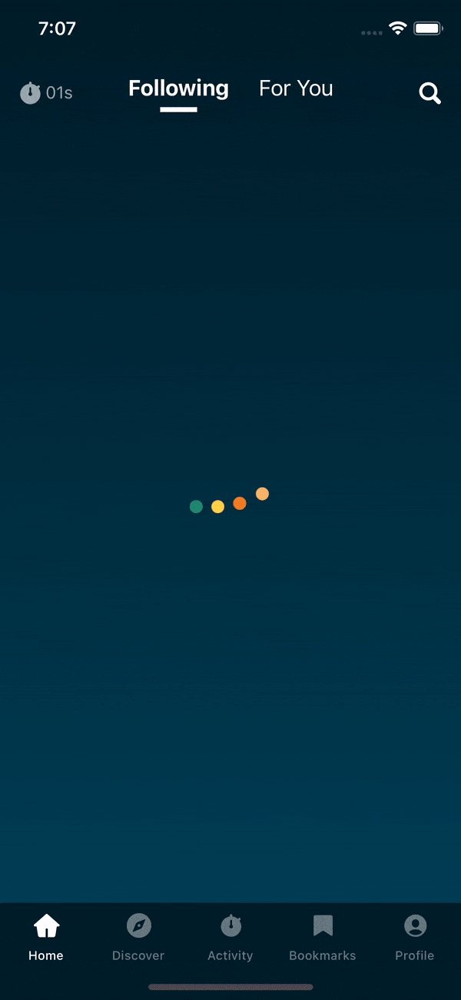

## Quizlr App

#### App Demo

**1. How long did it take to complete the assessment? (minutes)**

It took me roughly 8hours(480 minutes) to complete the task in scope.

**2. A link to a 3-5 minute video recording showing the app implementation vs. requirements and explaining the code architecture.**

<iframe src="https://www.loom.com/embed/b21fc67b6f6b47f7a24b1dead5f26104" frameborder="0" webkitallowfullscreen mozallowfullscreen allowfullscreen style="position: absolute; top: 0; left: 0; width: 100%; height: 100%;"></iframe>

[https://www.loom.com/share/b21fc67b6f6b47f7a24b1dead5f26104](https://www.loom.com/share/b21fc67b6f6b47f7a24b1dead5f26104)

**3. Does the cross-platform framework that you chose have access to native OS functions?**

I used react native and it has access to native OS functions.

React Native uses a bridge to communicate between JS and the underlying native platform, which allows it to access and use any native functionality provided by the platform.

**4. Do you have any feedback for us regarding the assessment?**

I think the expected time i.e 3.5h is less to compete assessment effectively.

Overall I loved the designs of the app and enjoyed developing the UI, I fond some inconsistencies in the design elements, like consistent padding, colors and font sizes for test elements etc.

#### App Demo

